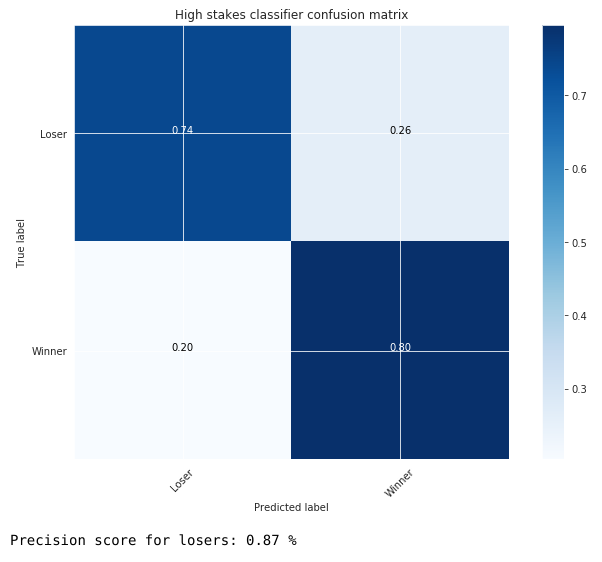

# Poker-Player-Classifier

### Introduction
The goal of this classifier is to help us identify winning or losing players using their statistics.
- If we play a small stakes game we'll want to avoid playing against winning players
- If we play a high stakes game we'll want to target the bad players

### Methodology
The **CRoss-Industry Standard Process for Data Mining - (CRISP-DM)** will be the method we will be using to process the data we are working on.

Our dataset is comprised of various online poker players and the statistical averages for their actions for each hand they play. We both have a good **business and data understanding** of our problem and of our dataset as we both have long histories of playing online poker.

Our **data preperation** was made easy as we were able to extract data directly from a poker database manager (Holdem Manager 2) which was in a well formated csv format and did not have any null values.

### Modelling
To build our model and make our predictions we followed the following steps:
- Cleaning the data
- Build our target
- Check class imbalance
- Splitting data into train and test sets
- Build a baseline model using Logistic Regression with a 5 folds Cross Validation
- Creating interactions features
- Creating polynomials features
- Building pipelines for the following classifiers
 - K-Nearest Neighbors
 - Random Forests
 - XGBoost
- Then digged deeper using GridSearchCV on our different models
- Chose a threshold independent score (ROC AUC) to chose the best model
- Plot the Confusion Matrix for our corresponding threshold

#### Classifying players in High Stakes Poker
Our classifier will tell us 74 percent of the losers on the table and will make mistakes only 13% of the time when predicting losing players.

#### Classifying players in Low Stakes Poker
Our classifier will only tell us a third of the actual winners on the table but will make mistakes only 13% of the time when predicting winning players.

### Conclusions
Using different threshold for different situations we were able to generate meaningful and precise predictions.

We can now deploy this model and use it when we play online poker. 
- When playing high stakes poker, we want to be able to predict with high certainty if a player is a losing player as there are less losing players at the higher stakes.
- When playing small stakes poker we want to predict if a player is a winning player, as most players will be losing players.

Having those informations, we can now target _**fishes**_ when playing high stakes poker and avoiding _**sharks**_ when playing small stakes poker.

### Presentation
You can find our slides presentation here => [Slides presentation](https://docs.google.com/presentation/d/1lfoIPVEPaBaRLVZpeougeDJhT0G_QIe3ML4R95xIyBk/edit#slide=id.g76c9ae535d_1_700)
