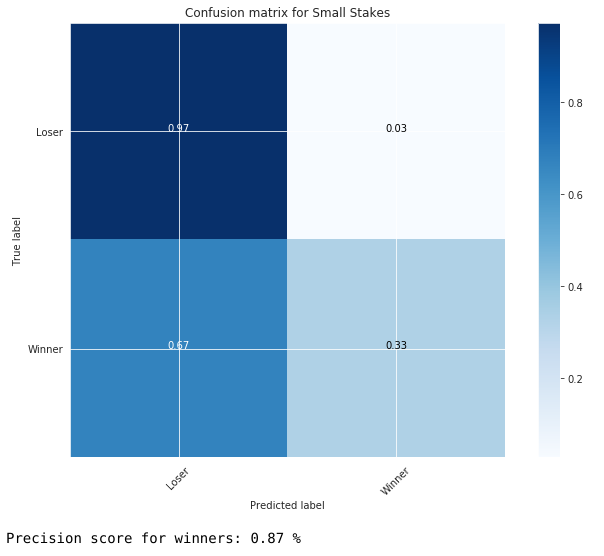

# Poker-Player-Classifier

### Introduction
This analysis aims to classify poker players as winning or losing player based on their stats

### Methodology
The CRoss-Industry Standard Process for Data Mining - (CRISP-DM) will be the method we will be using to process the data we are working on.

Our dataset is comprised of various online poker players and the statistical averages for their actions for each hand they play. We both have a good business and data understanding of our problem and of our dataset as we both have long histories of playing online poker.

Our data preperation was made easy as we were able to download data directly from a poker database which was well formated and did not have any null values.

### Modelling
We decided to use various modelling strategies, such as;
- splitting data into train and test sets
- logisitic regression using cross validation
- checking for interactions
- Checking which polynomials have the biggest impact once added to our baseline model
- ROC AUC curves
- building pipelines
- random forrests
- XGBoost
- Confusion Matrix

### Conclusions
When predicting winners or losers separately we have a 94% accuracy as shown by the graphs below

#### Classifying players in High Stakes Poker
We targeted trying to pick losing players for high stakes poker games.

#### Classifying players in Low Stakes Poker
We targeted trying to pick winning players for low stakes poker games.
